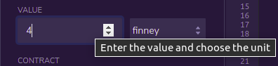

# The King Of The Hill
## The game for only people who has Ethereum in their personal wallet
-------------------------------------------------------
[This Game was edit into Rinkeby](https://rinkeby.etherscan.io/tx/0x107d00bc6cfc5b23d9e2a487da39de0fd57455b55c12fa7995738613d174509c)

# IN FIRST
## Rules for the deployor :

Want to be the creator of a betting game that will earn you *10%* of everything others have invested ?

### This game is for YOU !

1. Enter in **VALUE** a minimum one finney
2. Go on **DEPLOY** and enter your wallet address on **OWNERFIRST_**
3. Choose how many mining blocks separate the last bet from the winning mining block in **HOWMANYBLOCK_** !
>(it is recommended to choose restricted numbers for a test but between 8 and 16 blocks for a real game)


--------------------------------------------------
# IN SECOND
## Rules for the players :

### Want to be rich ?

So come and challenge the web and win 80% of the bet ! the principle is simple:

* pay more than double the stake in winnings
    (the difference will always be yours)




* To find out you just have to question the button **BLOCKTOURCHOOSE** to find out the number of blocks chosen by the game developer.


* And the button **GETNUMBERBLOCK** which will tell you how many blocks have passed since your bet.


* To find out how much is in bet then press the **GETGAIN** button.


* To find out who is the king of the hill press the button **HOWISTHEKING**.


If the number of blocks mined from your bet is greater than or equal to that expected, then 2 options :
1. You press the button - and get your 80% back.


2. You run out of time and / or someone overbid before you get your money back, the game distributes your bet of 80% and re-starts a game with the new player's bet.


---------------------------
# PART CODE
--------------------

Contract :

```js
contract The_King_Of_The_Hill {

    using Address for address payable;
    
    mapping(address => uint256) private _balances; //   _balances : reste of bet for the player (only bet x2 )
    address private _ownerFirst; //                     _ownerFirst : owner deploy contract and have 10% of the bet
    address private _ownerWin; //                       _ownerWin : winner of the turn (last payer)
    uint256 private _gains; //                          _gains : total of gain in the contract
    uint256 private _blockNumberinit; //                _blockNumberinit : initial number when last player has paid
    uint256 private _howManyBlock; //                   _howManyBlock : number of block playing
    uint256 private _blockToWin; //                     _blockToWin : initial block + number of block playing
    
/**
 * @dev event HowIsTheNewKing is emit when someone is the is the new king
* @dev event AndTheWinnerIs is emit when the winner claim is reward
 */
    
//event
    event HowIsTheNewKing (address indexed account, uint256 value);
     event AndTheWinnerIs (address indexed account, uint256 value);
    
/** 
 * @dev Create a new ownerFirst_ and choose how many block for the game.
 * @param ownerFirst_ and howManyBlock_ is choose by ownerFirst_.
 */
 
 //constructor
    constructor (address ownerFirst_, uint256 howManyBlock_) payable {
        require(msg.value >= 1e15, "The-King-Of-The-Hill : 1 finei minimum");
        _gains = msg.value;
        _ownerFirst = ownerFirst_;
        _howManyBlock = howManyBlock_;
    }
    
/**
 * @dev revert if the sender is not the winner (_ownerWin).
 */
    
//modifier
    modifier onlyOwnerWin() {
        require (msg.sender == _ownerWin, "The-King-Of-The-Hill : You are not the winner");
        _;
    }
    
/**
 * @dev Change _ownerWin by the last payed
 *      
 *      rules :
 *              - require amount initial in the contract x 2
 *              - require sender is not the owner of the smart-contract
 */
    //function to play a game
function theKingIsMe() public payable {
        
    // if the number of block pasted is equal at the block number initial + "howManyBlock_" choose by the Owner
    // paid the _ownerWin 80 of the gain, and paid the ownerFirst_(owner) 10% of the gain
    // the 10% of the rest in the contract is for the new game
    
    require(msg.value >= _gains * 2, "The-King-Of-The-Hill : give the gain x 2 for play");
    require(msg.sender != _ownerFirst, "The-King-Of-The-Hill : Owner can not play, sorry");
    if(block.number - _blockNumberinit >= _howManyBlock) {
    uint256 gainWinner = (_gains * 80) / 100;
    uint256 gainOwner = (_gains * 10) / 100;
    payable(_ownerWin).sendValue(gainWinner);
    payable(_ownerFirst).sendValue(gainOwner);
    _gains += _gains * 2;
    _balances[msg.sender] = msg.value - ((_gains / 3) * 2);
    emit AndTheWinnerIs(msg.sender, gainWinner);
    } else {
        _gains += msg.value;
        _ownerWin = msg.sender; 
        _balances[msg.sender] = msg.value - (_gains / 2);
        payable(msg.sender).sendValue(_balances[msg.sender]);
            
        // if the player bet more than x 2 of gain when he played, the difference are spend to the sender
     }
        
    // block number initial is initialised when somoene paid for be the king
        
    _blockNumberinit = block.number;
    _ownerWin = msg.sender;
    emit HowIsTheNewKing(msg.sender, msg.value);
}
    
/**
 * @dev Set the gain by the winner (_ownerWin only) and paid _ownerWin and _ownerFirst.
 */
    
function tresorOfHill() public onlyOwnerWin {
    
    // require the good number of block otherwise revert
    // gains partaged 80 % for _ownerWin, 10 % for _ownerFirst ans the reste rest in the contract
    
    require(_howManyBlock + _blockNumberinit <= block.number, "The-King-Of-The-Hill : Wait the end of the game for get   gain");
    uint256 gainWinner = (_gains * 80) / 100;
    uint256 gainOwner = (_gains * 10) / 100;
    payable(_ownerWin).sendValue(gainWinner);
    payable(_ownerFirst).sendValue(gainOwner);
    _gains = address(this).balance;
    emit AndTheWinnerIs(msg.sender, gainWinner);
    _ownerWin = address(0);
    }
    
/** 
 * @dev Calls getGains() and report the number of this
 * @return total of gains
 */
    
    function getGains() public view returns (uint256) {
        return _gains;
    }
    
/** 
 * @dev Calls howsIsTheKing() and report the address of this
 * @return address of winner
 */
    
    function howsIsTheKing() public view returns (address){
        return _ownerWin;
    }

/** 
 * @dev Calls blockTourChoose() and report the number of the block choose at deploiment
 * @return number of howManyBlock_
 */
    
    function blockTourChoose() public view returns (uint256) {
        return _howManyBlock;
    }

/** 
 * @dev Calcul of block pasted
 * @return total of number block is pasted
 */

    function getNumberBlockPaste() public view returns (uint256) {
        return (block.number - _blockNumberinit);
    }
}
```