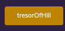

# The King Of The Hill
## The game for only people who has Ethereum in their personal wallet
-------------------------------------------------------
[This Game was edit into Rinkeby](https://rinkeby.etherscan.io/tx/0x107d00bc6cfc5b23d9e2a487da39de0fd57455b55c12fa7995738613d174509c)

# IN FIRST
## Rules for the deployor :

Want to be the creator of a betting game that will earn you *10%* of everything others have invested ?

### This game is for YOU !

1. Enter in **VALUE** a minimum one finney
2. Go on **DEPLOY** and enter your wallet address on **OWNERFIRST_**
3. Choose how many mining blocks separate the last bet from the winning mining block in **HOWMANYBLOCK_** !
>(it is recommended to choose restricted numbers for a test but between 8 and 16 blocks for a real game)

# IN SECOND
## Rules for the players :

### Want to be rich ?

So come and challenge the web! the principle is simple:

* pay more than double the stake in winnings
    (the difference will always be yours)

* To find out you just have to question the button **BLOCKTOURCHOOSE** to find out the number of blocks chosen by the game developer

* And the button **GETNUMBERBLOCK** which will tell you how many blocks have passed since your bet

* To find out how much is in bet then press the **GETGAIN** button

* To find out who is the king of the hill press the button **HOWISTHEKING**

If the number of blocks mined from your bet is greater than or equal to that expected, then 2 options:
1. You press the button - and get your 80% back.

2. You run out of time and / or someone overbid before you get your money back, the game distributes your bet and re-starts a game with the new player's bet.

